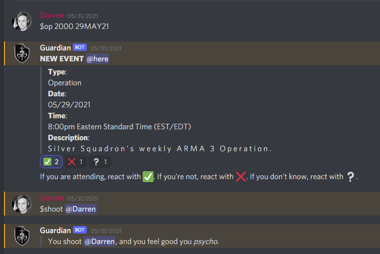
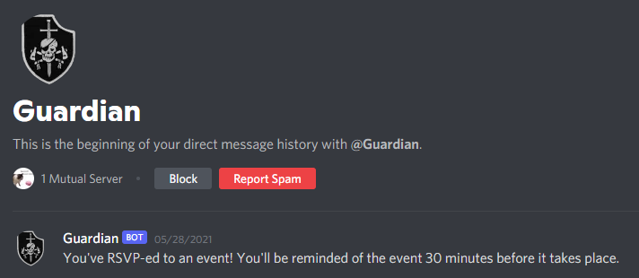

# DEVGRU Silver Squadron's Personal Discord Bot

## Purpose

To create event "notifications" and send out reminders (if the user opts in) to the Silver Squadron Arma 3 community. Takes the following formats:

mm/dd/yy HH:MM (12 hour clock)
DDMONTHYY HHMM (US Military Date format, 24-hour clock)

## What can it do?

It can create be used to create public events and send out reminders an hour before they're taking place.

It also has has error logging and exception, along with a "shoot" command (running joke among the unit).

Also comes with a markdown wiki (built for future collaboration).

## Can I use/update it?

For both: Go for it. If you use it as is though, you'll probably encounter multiple problems (for one, the bot is hardcoded to only spit out times in US EST/EDT time.)

## What do I need to run this?

You need Python 3.9.5, and make sure you pip install `requirements.txt`.

Depending on your language server, you may get bombarded with angry undefines and errors due to the way functions were seperated.

## Will you continue work on this?

Well since the concept of the bot was to be a simple reminder bot, and it can already do that, no. I could probably dive into the code and clean a lot of things up, as well are change the way the bot stores events (probably put them into a json and have the bot read and write from it).
